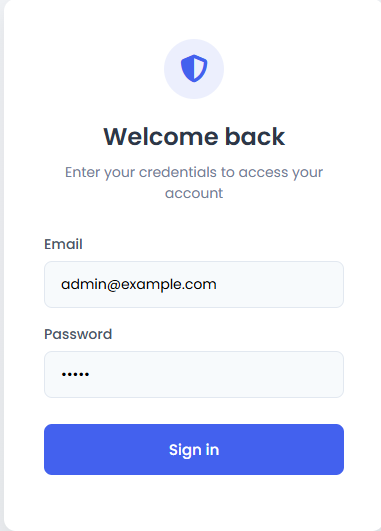

Clone the repository
in the terminal Install dependency npm install
Start the server by typing node server.js

you should see:
Server running on http://localhost:3000

change url to http://localhost:3000/admin to view admin panel 
Login using:
Email	admin@example.com
Password	admin
After logging in, you will be redirected to the dashboard showing mock statistics.

Login Page

Dashboard

